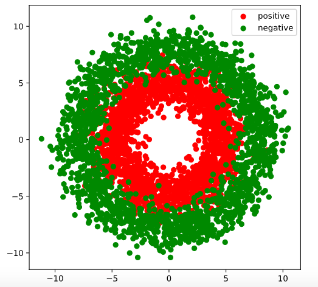
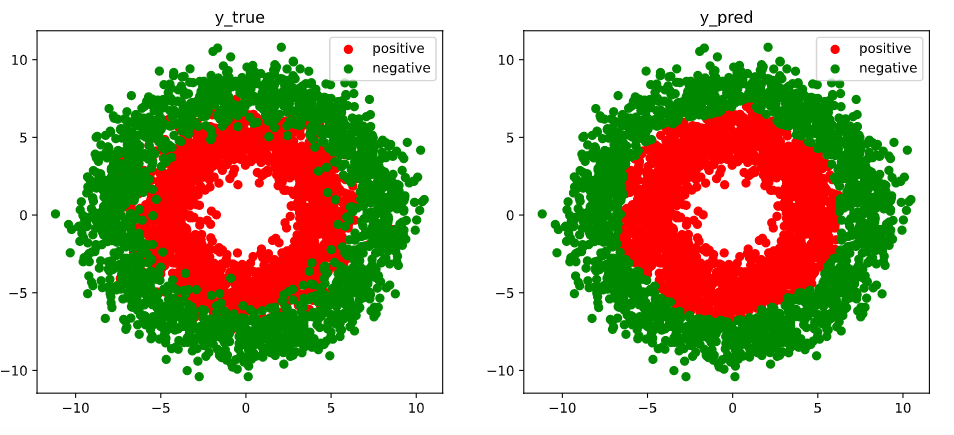
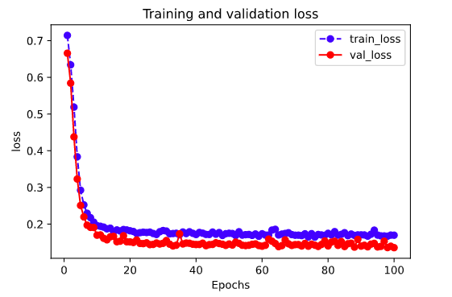
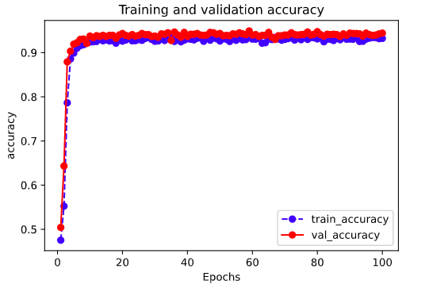

# 1，Introduction


The torchkeras library is a simple tool for training neural network in pytorch jusk like in a keras style. 😋😋

With torchkeras, You need not to write your training loop with many lines of code, all you need to do is just 

like this three steps as below:

(i) create your network and wrap it and the loss_fn together with torchkeras.KerasModel like this: `model = torchkeras.KerasModel(net,loss_fn)` 

(ii) fit your model with the training data and validate data.

**This project seems somehow powerful, but the source code is very simple.**

**Actually, less than 200 lines of Python code.**

**If you want to understand or modify some details of this project, feel free to read and change the source code!!!**


# 2,  Use example


You can install torchkeras using pip:
`pip install torchkeras`


Here is a complete examples using torchkeras! 

```python
import numpy as np 
import pandas as pd 
from matplotlib import pyplot as plt
import torch
from torch import nn
import torch.nn.functional as F
from torch.utils.data import Dataset,DataLoader,TensorDataset

import torchkeras #Attention this line 


```

### (1) prepare data 

```python
%matplotlib inline
%config InlineBackend.figure_format = 'svg'

#number of samples
n_positive,n_negative = 2000,2000

#positive samples
r_p = 5.0 + torch.normal(0.0,1.0,size = [n_positive,1]) 
theta_p = 2*np.pi*torch.rand([n_positive,1])
Xp = torch.cat([r_p*torch.cos(theta_p),r_p*torch.sin(theta_p)],axis = 1)
Yp = torch.ones_like(r_p)

#negative samples
r_n = 8.0 + torch.normal(0.0,1.0,size = [n_negative,1]) 
theta_n = 2*np.pi*torch.rand([n_negative,1])
Xn = torch.cat([r_n*torch.cos(theta_n),r_n*torch.sin(theta_n)],axis = 1)
Yn = torch.zeros_like(r_n)

#concat positive and negative samples
X = torch.cat([Xp,Xn],axis = 0)
Y = torch.cat([Yp,Yn],axis = 0)


#visual samples
plt.figure(figsize = (6,6))
plt.scatter(Xp[:,0],Xp[:,1],c = "r")
plt.scatter(Xn[:,0],Xn[:,1],c = "g")
plt.legend(["positive","negative"]);
```



```python
# split samples into train and valid data.
ds = TensorDataset(X,Y)
ds_train,ds_val = torch.utils.data.random_split(ds,[int(len(ds)*0.7),len(ds)-int(len(ds)*0.7)])
dl_train = DataLoader(ds_train,batch_size = 100,shuffle=True,num_workers=2)
dl_val = DataLoader(ds_val,batch_size = 100,num_workers=2)

```

```python
for features,labels in dl_train:
    break
print(features.shape)
print(labels.shape)
```

```python

```

### (2) create the  model

```python
class Net(nn.Module):  
    def __init__(self):
        super().__init__()
        self.fc1 = nn.Linear(2,4)
        self.fc2 = nn.Linear(4,8) 
        self.fc3 = nn.Linear(8,1)
        
    def forward(self,x):
        x = F.relu(self.fc1(x))
        x = F.relu(self.fc2(x))
        y = nn.Sigmoid()(self.fc3(x))
        return y
        
net = Net()

from torchmetrics import Metric 
class Accuracy(Metric):
    def __init__(self, dist_sync_on_step=False):
        super().__init__(dist_sync_on_step=dist_sync_on_step)

        self.add_state("correct", default=torch.tensor(0), dist_reduce_fx="sum")
        self.add_state("total", default=torch.tensor(0), dist_reduce_fx="sum")

    def update(self, preds: torch.Tensor, targets: torch.Tensor):
        assert preds.shape == targets.shape

        self.correct += torch.sum((preds>=0.5)==(targets>0.5))
        self.total += targets.numel()

    def compute(self):
        return self.correct.float() / self.total 
    
```

```python
model = torchkeras.KerasModel(net,
                              loss_fn = nn.BCELoss(),
                              optimizer= torch.optim.Adam(net.parameters(),lr = 0.05),
                              metrics_dict = {"acc":Accuracy()}
                             )

from torchkeras.summary import summary

summary(model,input_data=features);
```

### (3) train the model

```python
dfhistory=model.fit(epochs=30, train_data=dl_train, 
                    val_data=dl_val, patience=3, 
                    monitor="val_acc",mode="max")
```

```python
# visual the results
fig, (ax1,ax2) = plt.subplots(nrows=1,ncols=2,figsize = (12,5))
ax1.scatter(Xp[:,0],Xp[:,1], c="r")
ax1.scatter(Xn[:,0],Xn[:,1],c = "g")
ax1.legend(["positive","negative"]);
ax1.set_title("y_true")

Xp_pred = X[torch.squeeze(model.forward(X)>=0.5)]
Xn_pred = X[torch.squeeze(model.forward(X)<0.5)]

ax2.scatter(Xp_pred[:,0],Xp_pred[:,1],c = "r")
ax2.scatter(Xn_pred[:,0],Xn_pred[:,1],c = "g")
ax2.legend(["positive","negative"]);
ax2.set_title("y_pred")
```




### (4) evaluate the model

```python
%matplotlib inline
%config InlineBackend.figure_format = 'svg'

import matplotlib.pyplot as plt

def plot_metric(dfhistory, metric):
    train_metrics = dfhistory["train_"+metric]
    val_metrics = dfhistory['val_'+metric]
    epochs = range(1, len(train_metrics) + 1)
    plt.plot(epochs, train_metrics, 'bo--')
    plt.plot(epochs, val_metrics, 'ro-')
    plt.title('Training and validation '+ metric)
    plt.xlabel("Epochs")
    plt.ylabel(metric)
    plt.legend(["train_"+metric, 'val_'+metric])
    plt.show()
```

```python
plot_metric(dfhistory,"loss")
```



```python
plot_metric(dfhistory,"acc")
```




```python
model.evaluate(dl_val)
```

```
{'val_loss': 0.13576620258390903, 'val_accuracy': 0.9441666702429453}
```


### (5) use the model

```python
model.predict(dl_val)[0:10]
```

```
tensor([[0.8767],
        [0.0154],
        [0.9976],
        [0.9990],
        [0.9984],
        [0.0071],
        [0.3529],
        [0.4061],
        [0.9938],
        [0.9997]])
```

```python
for features,labels in dl_valid:
    with torch.no_grad():
        predictions = model.forward(features)
        print(predictions[0:10])
    break
```

```
tensor([[0.9979],
        [0.0011],
        [0.9782],
        [0.9675],
        [0.9653],
        [0.9906],
        [0.1774],
        [0.9994],
        [0.9178],
        [0.9579]])
```

### (6) save the model

```python
# save the model parameters

model_clone = torchkeras.KerasModel(Net(),loss_fn = nn.BCELoss(),
             optimizer= torch.optim.Adam(model.parameters(),lr = 0.01),
             metrics_dict={"acc":Accuracy()})
model_clone.net.load_state_dict(torch.load("checkpoint.pt"))
model_clone.evaluate(dl_val)
```

```
{'val_loss': 0.17422042911251387, 'val_accuracy': 0.9358333299557368}
```
