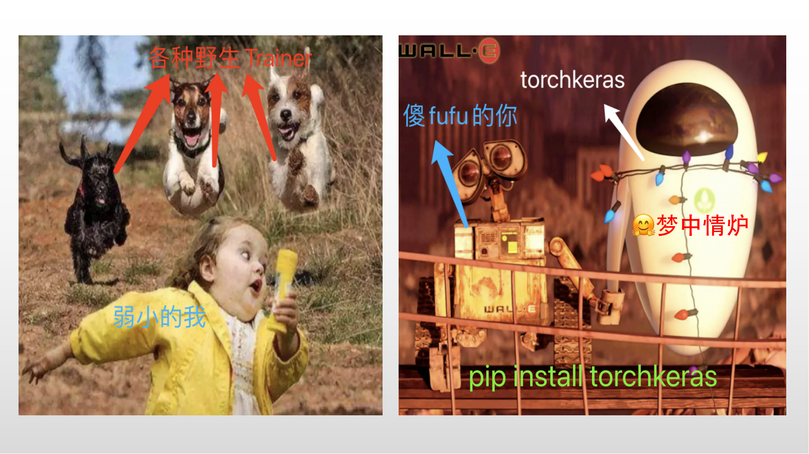
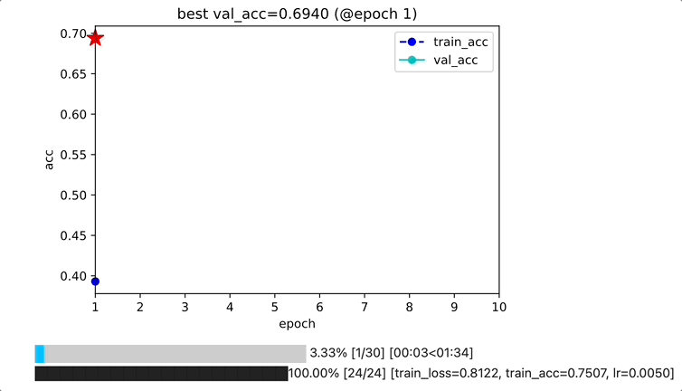

# 炼丹师，这是你的梦中情炉吗?🌹🌹


[English](README_en.md) | 简体中文


torchkeras 是一个通用的pytorch模型训练模版工具，按照如下目标进行设计和实现：

* **好看** (代码优雅，日志美丽，自带可视化)

* **好用** (使用方便，支持 进度条、评估指标、early-stopping等常用功能，支持tensorboard，wandb回调函数等扩展功能)

* **好改** (修改简单，核心代码模块化，仅约200行，并提供丰富的修改使用案例)


```python

```

## 1，炼丹之痛 😭😭


无论是学术研究还是工业落地，pytorch几乎都是目前炼丹的首选框架。

pytorch的胜出不仅在于其简洁一致的api设计，更在于其生态中丰富和强大的模型库。

但是我们会发现不同的pytorch模型库提供的训练和验证代码非常不一样。

torchvision官方提供的范例代码主要是一个关联了非常多依赖函数的train_one_epoch和evaluate函数，针对检测和分割各有一套。

yolo系列的主要是支持ddp模式的各种风格迥异的Trainer，每个不同的yolo版本都会改动很多导致不同yolo版本之间都难以通用。

抱抱脸的transformers库在借鉴了pytorch_lightning的基础上也搞了一个自己的Trainer，但与pytorch_lightning并不兼容。

非常有名的facebook的目标检测库detectron2, 也是搞了一个它自己的Trainer，配合一个全局的cfg参数设置对象来训练模型。

还有我用的比较多的语义分割的segmentation_models.pytorch这个库，设计了一个TrainEpoch和一个ValidEpoch来做训练和验证。

在学习和使用这些不同的pytorch模型库时，尝试阅读理解和改动这些训练和验证相关的代码让我受到了一万点伤害。

有些设计非常糟糕，嵌套了十几层，有些实现非常dirty，各种带下划线的私有变量满天飞。

让你每次想要改动一下加入一些自己想要的功能时就感到望而却步。

我不就想finetune一下模型嘛，何必拿这么多垃圾代码搞我？


```python

```

## 2，梦中情炉 🤗🤗

这一切的苦不由得让我怀念起tensorflow中keras的美好了。

还记得keras那compile, fit, evalute三连击吗？一切都像行云流水般自然，真正的for humans。

而且你看任何用keras实现的模型库，训练和验证都几乎可以用这一套相同的接口，没有那么多莫名奇妙的野生Trainer。

我能否基于pytorch打造一个接口和keras一样简洁易用，功能强大，但是实现代码非常简短易懂，便于修改的模型训练工具呢？

从2020年7月左右发布1.0版本到最近发布的3.86版本，我陆陆续续在工作中一边使用一边打磨一个工具，总共提交修改了70多次。

现在我感觉我细心雕琢的这个作品终于长成了我心目中接近完美的样子。


**她有一个美丽的名字：torchkeras.**
 
**是的，她兼具torch的灵动，也有keras的优雅~**

**并且她的美丽，无与伦比~**

**她，就是我的梦中情炉~ 🤗🤗**





```python

```


## 3，使用方法 🍊🍊


安装torchkeras
```
pip install torchkeras
```

通过使用torchkeras，你不需要写自己的pytorch模型训练循环。你只要做这样两步就可以了。

(1) 创建你的模型结构net,然后把它和损失函数传入torchkeras.KerasModel构建一个model。

(2) 使用model的fit方法在你的训练数据和验证数据上进行训练，训练数据和验证数据需要封装成两个DataLoader.


核心使用代码就像下面这样：

```python
import torch 
import torchkeras
import torchmetrics
model = torchkeras.KerasModel(net,
                              loss_fn = nn.BCEWithLogitsLoss(),
                              optimizer= torch.optim.Adam(net.parameters(),lr = 1e-4),
                              metrics_dict = {"acc":torchmetrics.Accuracy(task='binary')}
                             )
dfhistory=model.fit(train_data=dl_train, 
                    val_data=dl_val, 
                    epochs=20, 
                    patience=3, 
                    ckpt_path='checkpoint',
                    monitor="val_acc",
                    mode="max",
                    plot=True
                   )

```

在jupyter notebook中执行训练代码，你将看到类似下面的训练可视化图像和训练日志进度条。




## 4，主要特性 🍉🍉


torchkeras 支持以下这些功能特性，稳定支持这些功能的起始版本以及这些功能借鉴或者依赖的库的来源见下表。


|功能| 稳定支持起始版本 | 依赖或借鉴库 |
|:----|:-------------------:|:--------------|
|✅ 训练进度条 | 3.0.0   | 依赖tqdm,借鉴keras|
|✅ 训练评估指标  | 3.0.0   | 借鉴pytorch_lightning |
|✅ notebook中训练自带可视化 |  3.8.0  |借鉴fastai |
|✅ early stopping | 3.0.0   | 借鉴keras |
|✅ gpu training | 3.0.0    |依赖accelerate|
|✅ multi-gpus training(ddp) |   3.6.0 | 依赖accelerate|
|✅ fp16/bf16 training|   3.6.0  | 依赖accelerate|
|✅ tensorboard callback |   3.7.0  |依赖tensorboard |
|✅ wandb callback |  3.7.0 |依赖wandb |

```python

```

## 5，基本范例 🌰🌰


以下范例是torchkeras的基础范例，演示了torchkeras的主要功能。

包括基础训练，使用wandb可视化，使用wandb调参，使用tensorboard可视化，使用多GPU的ddp模式训练等。


|example| notebook    |  kaggle链接| 
|:----|:-------------------------|:-----------:|
|①基础范例 🔥🔥|  [**basic example**](./01，kerasmodel_example.ipynb)  |  <br><div></a><a href="https://www.kaggle.com/lyhue1991/kerasmodel-example"></a></div><br>  |
|②wandb可视化 🔥🔥🔥|[**wandb demo**](./02，kerasmodel_wandb_demo.ipynb)   |  <br><div></a><a href="https://www.kaggle.com/lyhue1991/kerasmodel-wandb-example"></a></div><br>  |
|③wandb自动化调参🔥🔥|[**wandb sweep demo**](./03，kerasmodel_tuning_demo.ipynb)   |  <br><div></a><a href="https://www.kaggle.com/lyhue1991/torchkeras-loves-wandb-sweep"></a></div><br>  |
|④tensorboard可视化| [**tensorboard example**](./04，kerasmodel_tensorboard_demo.ipynb)   |  |
|⑤ddp/tpu训练范例| [**ddp tpu examples**](https://www.kaggle.com/code/lyhue1991/torchkeras-ddp-tpu-examples)   |<br><div></a><a href="https://www.kaggle.com/lyhue1991/torchkeras-ddp-tpu-examples"></a></div><br>  |

```python

```

## 6，进阶范例 🔥🔥 

在炼丹实践中，遇到的数据集结构或者训练推理逻辑往往会千差万别。

例如我们可能会遇到多输入多输出结构，或者希望在训练过程中计算并打印一些特定的指标等等。

这时候炼丹师可能会倾向于使用最纯粹的pytorch编写自己的训练循环。

实际上，torchkeras提供了极致的灵活性来让炼丹师掌控训练过程的每个细节。

从这个意义上说，torchkeras更像是一个训练代码模版。

这个模版由低到高由StepRunner，EpochRunner 和 KerasModel 三个类组成。

在绝大多数场景下，用户只需要在StepRunner上稍作修改并覆盖掉，就可以实现自己想要的训练推理逻辑。

就像下面这段代码范例，这是一个多输入的例子，并且嵌入了特定的accuracy计算逻辑。

这段代码的完整范例，见examples下的CRNN_CTC验证码识别。

```python

import torch.nn.functional as F 
from torchkeras import KerasModel
from accelerate import Accelerator

#我们覆盖KerasModel的StepRunner以实现自定义训练逻辑。
#注意这里把acc指标的结果写在了step_losses中以便和loss一样在Epoch上求平均，这是一个非常灵活而且有用的写法。

class StepRunner:
    def __init__(self, net, loss_fn, accelerator=None, stage = "train", metrics_dict = None, 
                 optimizer = None, lr_scheduler = None
                 ):
        self.net,self.loss_fn,self.metrics_dict,self.stage = net,loss_fn,metrics_dict,stage
        self.optimizer,self.lr_scheduler = optimizer,lr_scheduler
        self.accelerator = accelerator if accelerator is not None else Accelerator()
        if self.stage=='train':
            self.net.train() 
        else:
            self.net.eval()
    
    def __call__(self, batch):
        
        images, targets, input_lengths, target_lengths = batch
        
        #loss
        preds = self.net(images)
        preds_log_softmax = F.log_softmax(preds, dim=-1)
        loss = F.ctc_loss(preds_log_softmax, targets, input_lengths, target_lengths)
        acc = eval_acc(targets,preds)
            

        #backward()
        if self.optimizer is not None and self.stage=="train":
            self.accelerator.backward(loss)
            self.optimizer.step()
            if self.lr_scheduler is not None:
                self.lr_scheduler.step()
            self.optimizer.zero_grad()
            
            
        all_loss = self.accelerator.gather(loss).sum()
        
        #losses （or plain metric that can be averaged）
        step_losses = {self.stage+"_loss":all_loss.item(),
                       self.stage+'_acc':acc}
        
        #metrics (stateful metric)
        step_metrics = {}
        if self.stage=="train":
            if self.optimizer is not None:
                step_metrics['lr'] = self.optimizer.state_dict()['param_groups'][0]['lr']
            else:
                step_metrics['lr'] = 0.0
        return step_losses,step_metrics
    
#覆盖掉默认StepRunner 
KerasModel.StepRunner = StepRunner 

```

可以看到，这种修改实际上是非常简单并且灵活的，保持每个模块的输出与原始实现格式一致就行，中间处理逻辑根据需要灵活调整。

同理，用户也可以修改并覆盖EpochRunner来实现自己的特定逻辑，但我一般很少遇到有这样需求的场景。

examples目录下的范例库包括了使用torchkeras对一些非常常用的库中的模型进行训练的例子。

例如：

* torchvision
* transformers
* segmentation_models_pytorch
* ultralytics
* timm

> 如果你想掌握一个东西，那么就去使用它，如果你想真正理解一个东西，那么尝试去改变它。 ———— 爱因斯坦


|example|使用模型库  |notebook |
|:----|:-----------|:-----------:|
||||
|**RL**|||
|强化学习——Q-Learning 🔥🔥|- |[Q-learning](./examples/Q-learning.ipynb)|
|强化学习——DQN|- |[DQN](./examples/DQN.ipynb)|
||||
|**CV**|||
|图片分类——Resnet|  -  | [Resnet](./examples/ResNet.ipynb) |
|语义分割——UNet|  - | [UNet](./examples/UNet.ipynb) |
|目标检测——SSD| -  | [SSD](./examples/SSD.ipynb) |
|文字识别——CRNN 🔥🔥| -  | [CRNN-CTC](./examples/CRNN_CTC.ipynb) |
|目标检测——FasterRCNN| torchvision  |  [FasterRCNN](./examples/FasterRCNN——vision.ipynb) | 
|语义分割——DeepLabV3++ | segmentation_models_pytorch |  [Deeplabv3++](./examples/Deeplabv3plus——smp.ipynb) |
|实例分割——MaskRCNN | detectron2 |  [MaskRCNN](./examples/MaskRCNN——detectron2.ipynb) |
|图片分类——SwinTransformer|timm| [Swin](./examples/SwinTransformer——timm.ipynb)|
|目标检测——YOLOv8 🔥🔥🔥| ultralytics |  [YOLOv8_Detect](./examples/YOLOV8_Detect——ultralytics.ipynb) |
|实例分割——YOLOv8 🔥🔥🔥| ultralytics |  [YOLOv8_Segment](./examples/YOLOV8_Segment——ultralytics.ipynb) |
||||
|**NLP**|||
|序列翻译——Transformer🔥🔥| - |  [Transformer](./examples/Dive_into_Transformer.ipynb) |
|文本生成——Llama🔥| - |  [Llama](./examples/Dive_into_Llama.ipynb) |
|文本分类——BERT| transformers |  [BERT](./examples/BERT——transformers.ipynb) |
|命名实体识别——BERT | transformers |  [BERT_NER](./examples/BERT_NER——transformers.ipynb) |
|LLM微调——ChatGLM2_LoRA 🔥🔥🔥| transformers |  [ChatGLM2_LoRA](./examples/ChatGLM2_LoRA——transformers.ipynb) |
|LLM微调——ChatGLM2_AdaLoRA 🔥| transformers |  [ChatGLM2_AdaLoRA](./examples/ChatGLM2_AdaLoRA——transformers.ipynb) |
|LLM微调——ChatGLM2_QLoRA | transformers |  [ChatGLM2_QLoRA_Kaggle](./examples/ChatGLM2_QLoRA_Kaggle——transformers.ipynb) |
|LLM微调——BaiChuan13B_QLoRA | transformers |  [BaiChuan13B_QLoRA](./examples/BaiChuan13B_QLoRA——transformers.ipynb) |
|LLM微调——BaiChuan13B_NER 🔥🔥🔥| transformers |  [BaiChuan13B_NER](./examples/BaiChuan13B_NER——transformers.ipynb) |
|LLM微调——BaiChuan13B_MultiRounds 🔥| transformers |  [BaiChuan13B_MultiRounds](./examples/BaiChuan13B_MultiRounds——transformers.ipynb) |
|LLM微调——Qwen7B_MultiRounds 🔥🔥🔥| transformers |  [Qwen7B_MultiRounds](./examples/Qwen7B_MultiRounds——transformers.ipynb) |


```python

```

## 7，鼓励和联系作者 🎈🎈


**如果本项目对你有所帮助，想鼓励一下作者，记得给本项目加一颗星星star⭐️，并分享给你的朋友们喔😊!** 

如果在torchkeras的使用中遇到问题，可以在项目中提交issue。

如果想要获得更快的反馈或者与其他torchkeras用户小伙伴进行交流，

可以在公众号算法美食屋后台回复关键字：**加群**。

