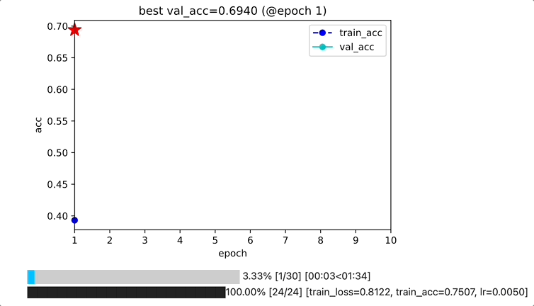

# Pytorch❤️Keras

English | [简体中文](README.md)


The torchkeras library is a simple tool for training neural network in pytorch jusk in a keras style. 😋😋


## 1, Introduction


With torchkeras, You need not to write your training loop with many lines of code, all you need to do is just 

like these two steps as below:

(i) create your network and wrap it and the loss_fn together with torchkeras.KerasModel like this: 
`model = torchkeras.KerasModel(net,loss_fn=nn.BCEWithLogitsLoss())`.

(ii) fit your model with the training data and validate data.


The main code of use torchkeras is like below.

```python
import torch 
import torchkeras

model = torchkeras.KerasModel(net,
                              loss_fn = nn.BCEWithLogitsLoss(),
                              optimizer= torch.optim.Adam(net.parameters(),lr = 0.001),
                              metrics_dict = {"acc":torchmetrics.Accuracy(task='binary')}
                             )
dfhistory=model.fit(train_data=dl_train, 
                    val_data=dl_val, 
                    epochs=20, 
                    patience=3, 
                    ckpt_path='checkpoint',
                    monitor="val_acc",
                    mode="max",
                    plot=True
                   )

```




Besides，You can use torchkeras.VLog to get the dynamic training visualization any where as you like ~

```python
import time
import math,random
from torchkeras import VLog

epochs = 10
batchs = 30

#0, init vlog
vlog = VLog(epochs, monitor_metric='val_loss', monitor_mode='min') 

#1, log_start 
vlog.log_start() 

for epoch in range(epochs):
    
    #train
    for step in range(batchs):
        
        #2, log_step (for training step)
        vlog.log_step({'train_loss':100-2.5*epoch+math.sin(2*step/batchs)}) 
        time.sleep(0.05)
        
    #eval    
    for step in range(20):
        
        #3, log_step (for eval step)
        vlog.log_step({'val_loss':100-2*epoch+math.sin(2*step/batchs)},training=False)
        time.sleep(0.05)
        
    #4, log_epoch
    vlog.log_epoch({'val_loss':100 - 2*epoch+2*random.random()-1,
                    'train_loss':100-2.5*epoch+2*random.random()-1})  

# 5, log_end
vlog.log_end()

```


**This project seems somehow powerful, but the source code is very simple.**

**Actually, only about 200 lines of Python code.**

**If you want to understand or modify some details of this project, feel free to read and change the source code!!!**

```python

```

## 2, Features 


The main features supported by torchkeras are listed below.

Versions when these features are introduced and the libraries which they used  or inspired from are given.


|features| supported from version | used or inspired by library  |
|:----|:-------------------:|:--------------|
|✅ training progress bar | 3.0.0   | use tqdm,inspired by keras|
|✅ training metrics  | 3.0.0   | inspired by pytorch_lightning |
|✅ notebook visualization in traning |  3.8.0  |inspired by fastai |
|✅ early stopping | 3.0.0   | inspired by keras |
|✅ gpu training | 3.0.0    |use accelerate|
|✅ multi-gpus training(ddp) |   3.6.0 | use accelerate|
|✅ fp16/bf16 training|   3.6.0  | use accelerate|
|✅ tensorboard callback |   3.7.0  |use tensorboard |
|✅ wandb callback |  3.7.0 |use wandb |
|✅ VLog |  3.9.5 | use matplotlib|


```python

```

Optional integrations such as lightgbm, catboost, transformers, ultralytics, and causalml live in `torchkeras.tools`.
Install the matching library first (for causalml use `pip install causalml`) and import `torchkeras.tools.calsualml`
to access the upstream package with a clearer missing-dependency error.

### 3, Basic Examples 

You can follow these full examples to get started with torchkeras.


|example| read notebook code     |  run example in kaggle| 
|:----|:-------------------------|:-----------:|
|①kerasmodel basic 🔥🔥|  [**torchkeras.KerasModel example**](./01，kerasmodel_example.ipynb)  |  <br><div></a><a href="https://www.kaggle.com/lyhue1991/kerasmodel-example"></a></div><br>  |
|②kerasmodel wandb 🔥🔥🔥|[**torchkeras.KerasModel with wandb demo**](./02，kerasmodel_wandb_demo.ipynb)   |  <br><div></a><a href="https://www.kaggle.com/lyhue1991/kerasmodel-wandb-example"></a></div><br>  |
|③kerasmodel tunning 🔥🔥🔥|[**torchkeras.KerasModel with wandb sweep demo**](./03，kerasmodel_tuning_demo.ipynb)   |  <br><div></a><a href="https://www.kaggle.com/lyhue1991/torchkeras-loves-wandb-sweep"></a></div><br>  |
|④kerasmodel tensorboard | [**torchkeras.KerasModel with tensorboard example**](./04，kerasmodel_tensorboard_demo.ipynb)   |  |
|⑤kerasmodel ddp/tpu | [**torchkeras.KerasModel  ddp tpu examples**](https://www.kaggle.com/code/lyhue1991/torchkeras-ddp-tpu-examples)   |<br><div></a><a href="https://www.kaggle.com/lyhue1991/torchkeras-ddp-tpu-examples"></a></div><br>  |
|⑥ VLog for lightgbm/ultralytics/transformers🔥🔥🔥| [**VLog example**](./10，vlog_example.ipynb)   |  |


### 4, Advanced Examples 

In some using cases, because of the differences  of the model input types, you need to rewrite the StepRunner of 
KerasModel. Here are some examples.

|example|model library  |notebook |
|:----|:-----------|:-----------:|
||||
|**RL**|||
|ReinforcementLearning——Q-Learning🔥🔥|- |[Q-learning](./examples/Q-learning.ipynb)|
|ReinforcementLearning——DQN|- |[DQN](./examples/DQN.ipynb)|
||||
|**Tabular**|||
|BinaryClassification——LightGBM |- |[LightGBM](./examples/LightGBM二分类.ipynb)|
|MultiClassification——Tabm🔥🔥🔥🔥🔥|- |[Tabm](./examples/Tabm多分类.ipynb)|
|MultiClassification——FTTransformer🔥🔥|- |[FTTransformer](./examples/FTTransformer多分类.ipynb)|
|BinaryClassification——FM|- |[FM](./examples/FM二分类.ipynb)|
|BinaryClassification——DeepFM|- |[DeepFM](./examples/DeepFM二分类.ipynb)|
|BinaryClassification——DeepCross|- |[DeepCross](./examples/DeepCross二分类.ipynb)|
||||
|**CV**|||
|ImageClassification——Resnet|  -  | [Resnet](./examples/ResNet.ipynb) |
|ImageSegmentation——UNet|  - | [UNet](./examples/UNet.ipynb) |
|ObjectDetection——SSD| -  | [SSD](./examples/SSD.ipynb) |
|OCR——CRNN 🔥🔥| -  | [CRNN-CTC](./examples/CRNN_CTC.ipynb) |
|ImageClassification——SwinTransformer|timm| [Swin](./examples/SwinTransformer——timm.ipynb)|
|ObjectDetection——FasterRCNN| torchvision  |  [FasterRCNN](./examples/FasterRCNN——vision.ipynb) | 
|ImageSegmentation——DeepLabV3++ | segmentation_models_pytorch |  [Deeplabv3++](./examples/Deeplabv3plus——smp.ipynb) |
|InstanceSegmentation——MaskRCNN | detectron2 |  [MaskRCNN](./examples/MaskRCNN——detectron2.ipynb) |
|ObjectDetection——YOLOv8 🔥🔥🔥| ultralytics |  [YOLOv8](./examples/YOLOV8_Detect——ultralytics.ipynb) |
|InstanceSegmentation——YOLOv8 🔥🔥🔥| ultralytics |  [YOLOv8](./examples/YOLOV8_Segment——ultralytics.ipynb) |
||||
|**NLP**|||
|Seq2Seq——Transformer🔥🔥| - |  [Transformer](./examples/Dive_into_Transformer.ipynb) |
|TextGeneration——Llama🔥| - |  [Llama](./examples/Dive_into_Llama.ipynb) |
|TextClassification——BERT | transformers |  [BERT](./examples/BERT——transformers.ipynb) |
|TokenClassification——BERT | transformers |  [BERT_NER](./examples/BERT_NER——transformers.ipynb) |
|FinetuneLLM——ChatGLM2_LoRA 🔥🔥🔥| transformers,peft |  [ChatGLM2_LoRA](./examples/ChatGLM2_LoRA——transformers.ipynb) |
|FinetuneLLM——ChatGLM2_AdaLoRA 🔥| transformers,peft |  [ChatGLM2_AdaLoRA](./examples/ChatGLM2_AdaLoRA——transformers.ipynb) |
|FinetuneLLM——ChatGLM2_QLoRA🔥 | transformers |  [ChatGLM2_QLoRA_Kaggle](./examples/ChatGLM2_QLoRA_Kaggle——transformers.ipynb) |
|FinetuneLLM——BaiChuan13B_QLoRA🔥 | transformers |  [BaiChuan13B_QLoRA](./examples/BaiChuan13B_QLoRA——transformers.ipynb) |
|FinetuneLLM——BaiChuan13B_NER 🔥🔥🔥| transformers |  [BaiChuan13B_NER](./examples/BaiChuan13B_NER——transformers.ipynb) |
|FinetuneLLM——BaiChuan13B_MultiRounds 🔥| transformers |  [BaiChuan13B_MultiRounds](./examples/BaiChuan13B_MultiRounds——transformers.ipynb) |
|FinetuneLLM——Qwen7B_MultiRounds 🔥🔥🔥| transformers |  [Qwen7B_MultiRounds](./examples/Qwen7B_MultiRounds——transformers.ipynb) |
|FinetuneLLM——BaiChuan2_13B 🔥| transformers |  [BaiChuan2_13B](./examples/BaiChuan2_13B——transformers.ipynb) |


**If you want to understand or modify some details of this project, feel free to read and change the source code!!!**

Any other questions, you can contact the author form the wechat official account below:

**算法美食屋** 


